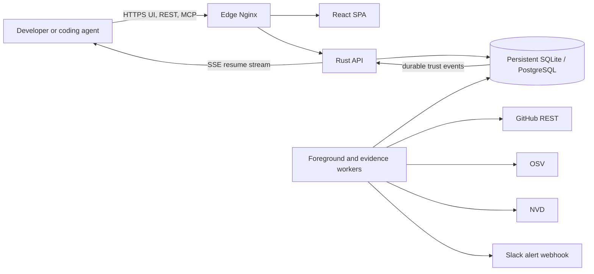
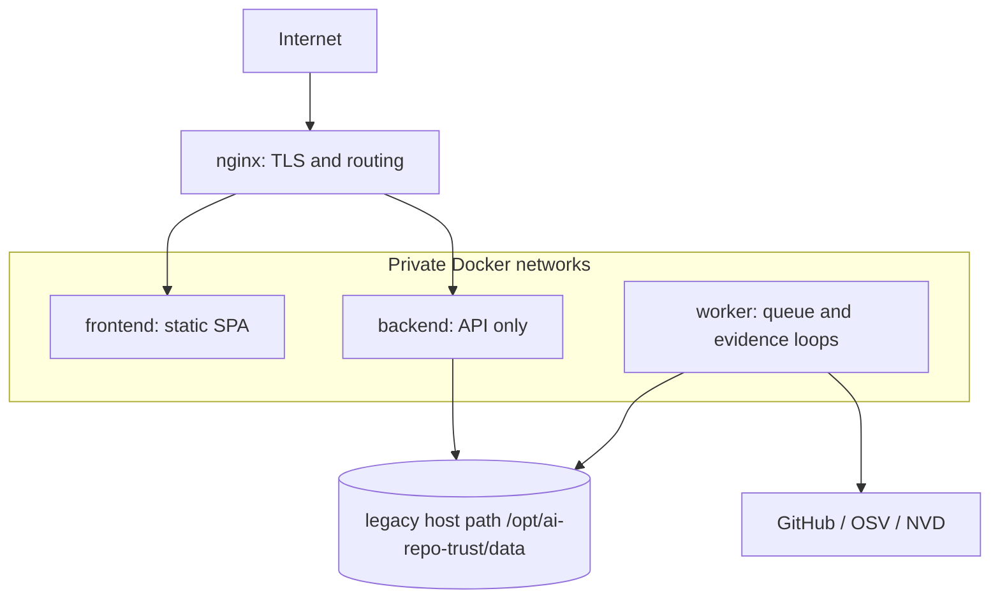
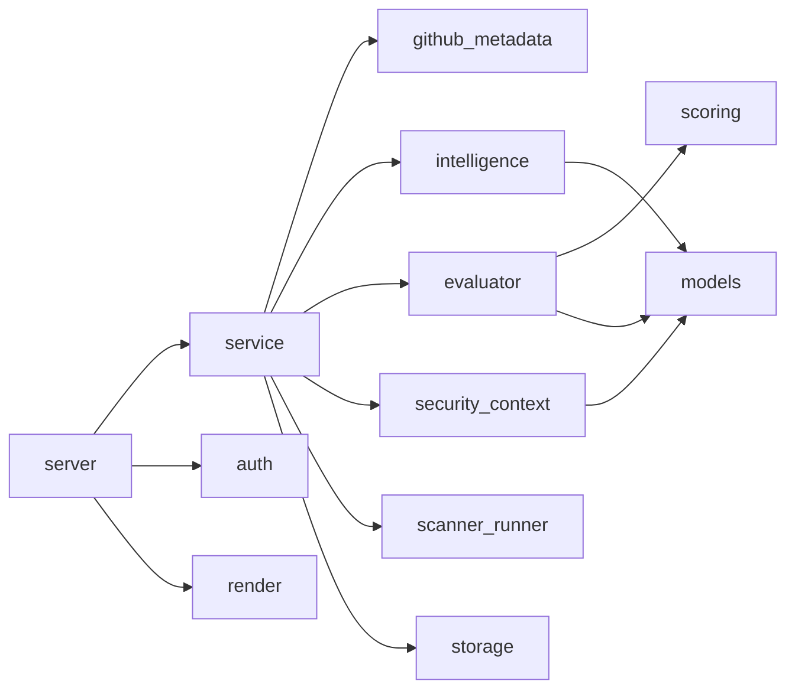
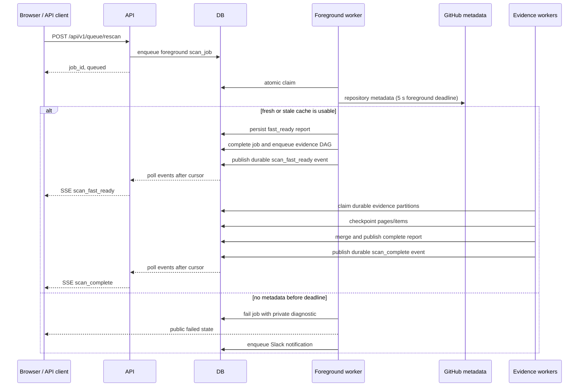
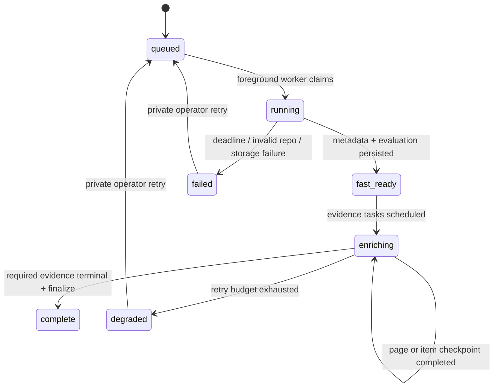
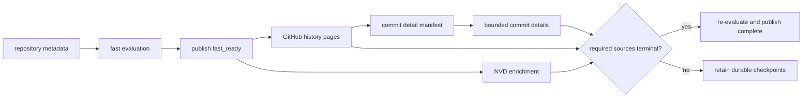
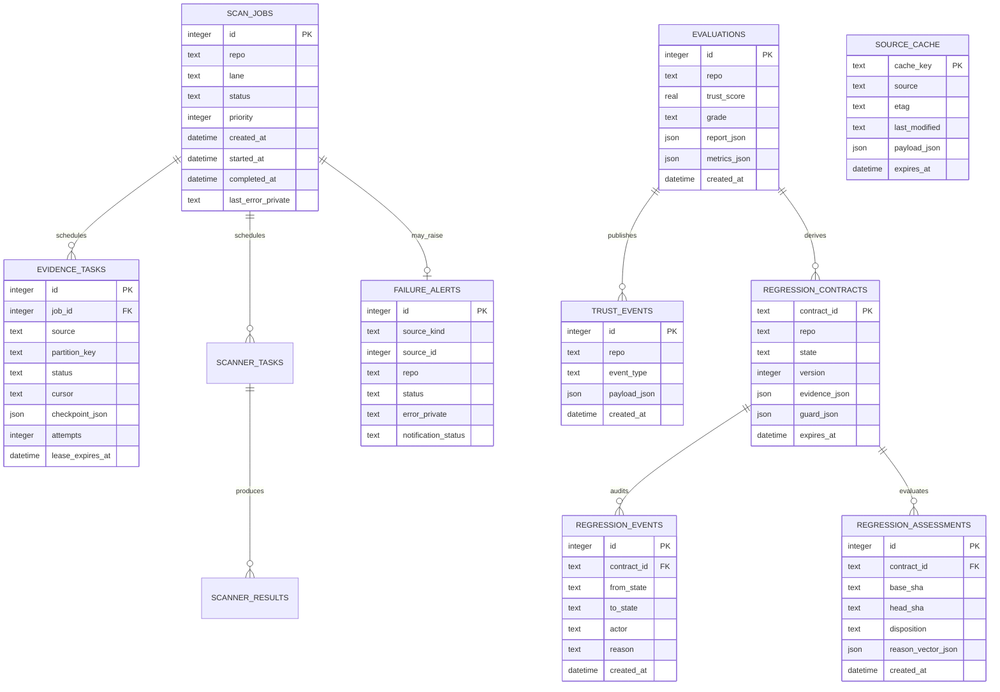
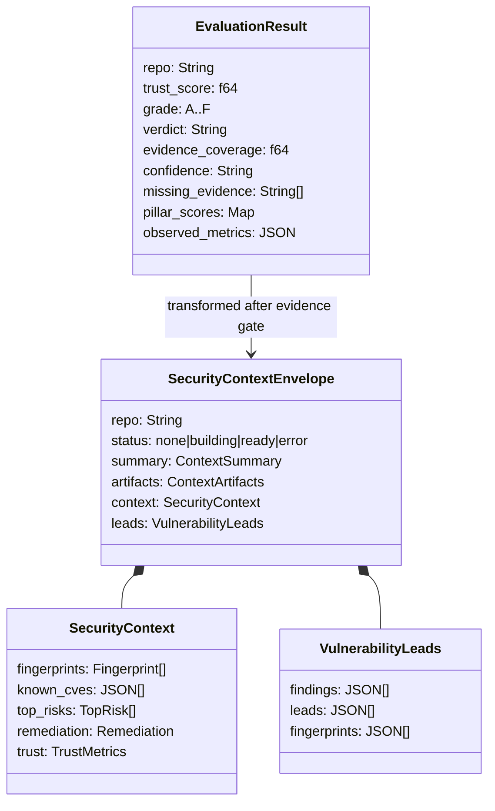

# Architecture

## Product scope

AI Supply Chain Trust evaluates public source repositories and publishes two
related outputs:

1. A trust decision with score, grade, evidence coverage, missing evidence, and
   recommended action.
2. A security context for coding agents: prior security fixes, disclosed CVEs,
   recurring risk classes, affected components, and regression-review leads.

The service is not a source-code hosting proxy, malware sandbox, exploit
generator, or guarantee that a repository is safe. A fast result is explicitly
partial until historical and vulnerability evidence completes.

## System context

## Production containers

Only Nginx publishes host ports. The API container has background workers
disabled. The worker container shares the persistent database volume and runs
independent foreground workers plus source-specific evidence workers.

## Backend modules

| Crate | Responsibility | May perform network I/O |
| --- | --- | --- |
| `models` | Serializable domain contracts | No |
| `scoring` | Grade and weighted score rules | No |
| `evaluator` | Eight-pillar deterministic evaluation | No |
| `github_metadata` | Canonical repository and owner metadata | GitHub |
| `intelligence` | Advisories, history, OSV, and NVD evidence | GitHub, OSV, NVD |
| `security_context` | Evidence gate, fingerprints, risks, leads, artifacts | No |
| `storage` | Reports, queues, leases, cache, events, alerts | Database |
| `service` | Scan orchestration and progressive finalization | Through clients |
| `server` | HTTP, SSE, MCP, validation, public error boundary | No direct evidence calls |
| `scanner_runner` | Optional external scanners | Local processes |
| `render` | Server-rendered artifact helpers | No |
| `auth` | Worker/admin bearer verification | No |
| `discovery` | Repository discovery | GitHub and registries |
| `cli` | Command-line parsing | No |

## Interactive scan lifecycle

The interactive queue and research/evidence work are separate. Foreground
workers only claim `scan_jobs`; source-specific workers claim `evidence_tasks`.
A slow history or NVD task cannot occupy a foreground worker.

## State machine

Public UI states are `queued`, `running`, `enriching`, `ready`, and `failed`.
Detailed upstream errors and retry controls are private and delivered to the
configured operations webhook.

## Evidence DAG

Every evidence task is unique by `(job_id, source, partition_key)`, leased,
checkpointed, retryable, and re-queued after an expired lease. Deploys reopen
`running` scan jobs as `queued`; completed evidence pages are not repeated.

GitHub background work preserves foreground capacity. The effective reserve is
`min(configured reserve, 10% of observed quota)`, so a 500-request production
reserve does not deadlock anonymous 60-request quotas.

Configured GitHub credentials are attempted before the anonymous fallback.
Finalize classification runs on Tokio's blocking pool so large histories cannot
starve HTTP health checks, SSE delivery, or foreground queue claims.

## Persistent data schema

SQLite is the production source today. PostgreSQL definitions exist for
multi-instance migration; code paths must not assume identical column names
without an adapter.

Regression contracts are evidence-backed, versioned review constraints rather
than editable vulnerability claims. Assessments are immutable for a
`(contract_id, base_sha, head_sha)` tuple; lifecycle changes append audit events
and use optimistic version checks. Missing analysis is represented explicitly
and never converted into a passing result.

## Public data contracts

## Reliability invariants

- Foreground metadata has a total deadline; retries cannot extend user-visible
  work indefinitely.
- A stale cached metadata object may support a clearly partial fast result; it
  never creates historical fixes or CVEs.
- Foreground worker loops are independent. One slow repository cannot stop
  other workers from claiming queued jobs.
- Evidence retries are durable and source-specific. A GitHub or NVD failure
  does not reset completed work from another source.
- Database files live on a host-mounted persistent path and are never replaced
  by deployment sync.
- Public responses remove upstream error details. Operations receive detailed
  alerts through the configured webhook.
- Browser updates use SSE/background requests; page navigation is not driven by
  timed full-page refreshes.
- SSE is backed by `trust_events`, not an in-process channel. New connections
  start at the latest event; reconnects resume from `Last-Event-ID`. Worker and
  API containers therefore do not need shared process memory.
