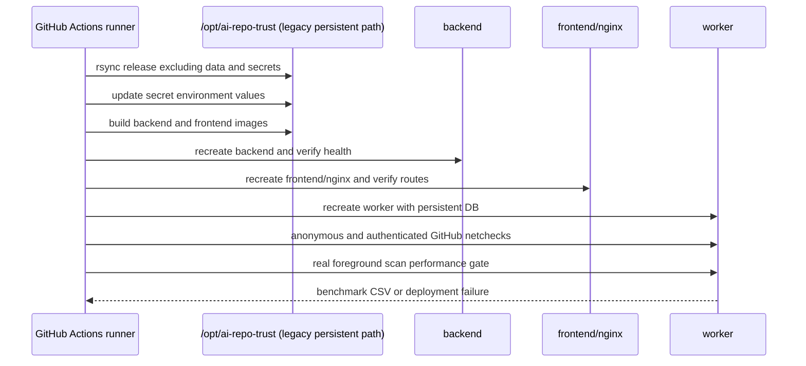

# Deployment and Operations

## Production topology

Production uses `.github/deploy/production/docker-compose.prod.yml` and four
long-running containers:

| Service | Role | Public port | Persistent data |
| --- | --- | --- | --- |
| `nginx` | TLS edge, routing, SSE proxy | HTTP/HTTPS host ports | certificate mount/cache only |
| `frontend` | Static React SPA | none | none |
| `backend` | REST, SSE, MCP, artifacts | none | `/data/trust.db` |
| `worker` | Foreground queue, evidence DAG, Slack alerts | none | `/data/trust.db` |

The backend and worker share the legacy persistent host path
`/opt/ai-repo-trust/data:/data`. The path is intentionally retained during the
product rename so existing production reports are not replaced. `sync_release`
excludes `data`, `.env.prod`, caches, and build targets. `prepare_data_dir`
preserves an existing database before containers are recreated.

The shared edge proxy is migrated independently, so the production backend and
frontend also retain the legacy `ai-repo-trust-*` Docker network aliases. These
compatibility aliases contain no product data and can be removed after the edge
proxy configuration uses the new `ai-supply-chain-trust-*` aliases.

## Routing

- `/` and browser routes -> frontend
- `/api`, `/api/*`, `/health`, `/sitemap.xml` -> backend
- `/mcp` -> backend
- `/r/*.json`, `/r/*.md` -> backend
- `/r/{owner}/{repo}` -> SPA shell
- legacy `/free-tools/*` URLs -> permanent redirect to the equivalent root URL
- `/api/v1/events` -> backend with proxy buffering disabled

## Sitemap policy

`/sitemap.xml` lists the six public core pages first. Repository context pages
follow in most-recently-evaluated order and are capped at 500 entries, well
below the protocol ceiling of 50,000 URLs or 50 MB uncompressed per sitemap.
Repository entries use the report evaluation date as `lastmod`; core pages omit
`lastmod` because no independently verifiable publication date is stored.

Only canonical root URLs are emitted. Legacy `/free-tools/*` paths remain as
permanent redirects for inbound-link migration and never appear in the sitemap.

Only Nginx publishes host ports. Backend and worker are reachable only on private
Docker networks.

## Deployment sequence



## Required release gates

The deployment workflow is successful only when all of these pass:

1. Backend and frontend images build.
2. Backend `/health` and `/api/v1/health` respond from inside the container.
3. Frontend health and expected CSS reference respond.
4. Edge route responds after Nginx recreation.
5. Worker can reach GitHub anonymously and with configured credentials using the
   same Rust/Reqwest stack as the application.
6. A real queued repository scan satisfies acceptance, queue wait, foreground,
   total latency, and terminal-success gates.

The benchmark result is stored at
`/opt/ai-repo-trust/data/deploy-scan-performance.csv`.

## Core configuration

| Variable | Production default | Meaning |
| --- | ---: | --- |
| `AI_SUPPLY_CHAIN_TRUST_DB_PATH` | `/data/trust.db` | Persistent SQLite file |
| `AI_SUPPLY_CHAIN_TRUST_DAEMON` | worker `1`, API `0` | Enable queue/evidence loops |
| `AI_SUPPLY_CHAIN_TRUST_DAEMON_MAX_CONCURRENT` | `6` | Independent foreground workers |
| `AI_SUPPLY_CHAIN_TRUST_DAEMON_QUEUE_INTERVAL` | `1` | Idle poll delay in seconds |
| `AI_SUPPLY_CHAIN_TRUST_WORKER_START_DELAY_SECONDS` | `0` | Delay before workers claim jobs |
| `AI_SUPPLY_CHAIN_TRUST_FOREGROUND_TIMEOUT_SECONDS` | `5` | Total metadata deadline for fast scans |
| `AI_SUPPLY_CHAIN_TRUST_GITHUB_TIMEOUT_SECONDS` | `20` | Per-request background client timeout |
| `AI_SUPPLY_CHAIN_TRUST_EVIDENCE_INTERVAL_SECONDS` | `1` | Idle evidence poll delay |
| `AI_SUPPLY_CHAIN_TRUST_EVIDENCE_HISTORY_CONCURRENCY` | `4` | Parallel checkpointed GitHub history workers |
| `AI_SUPPLY_CHAIN_TRUST_EVIDENCE_NVD_CONCURRENCY` | `2` | Parallel NVD evidence workers |
| `AI_SUPPLY_CHAIN_TRUST_EVIDENCE_FINALIZE_CONCURRENCY` | `2` | Parallel recovery/finalization workers |
| `AI_SUPPLY_CHAIN_TRUST_PROGRESSIVE_COMMIT_DETAIL_LIMIT` | `25` | Maximum detail tasks used for finalization |
| `GITHUB_TOKEN` / `GITHUB_TOKENS` | secret | Read-only GitHub credentials |
| `NVD_API_KEY` | secret | NVD request budget |
| `AI_SUPPLY_CHAIN_TRUST_ALERT_WEBHOOK_URL` | secret | Private failure diagnostics |
| `AI_SUPPLY_CHAIN_TRUST_FEEDBACK_WEBHOOK_URL` | secret | Slack incoming webhook for product feedback (falls back to alert webhook) |
| `AI_SUPPLY_CHAIN_TRUST_FAILURE_RECOVERY_INTERVAL_SECONDS` | config | Automatic recovery interval for transient failed work (default `600`) |
| `AI_SUPPLY_CHAIN_TRUST_WORKER_TOKEN` | secret | Admin/worker endpoint authorization |

Worker progress crosses the container boundary through the persistent
`trust_events` table. The backend tails this table for SSE clients and honors
`Last-Event-ID`; the process-local broadcast channel is not a reliability
boundary.

Configured tokens are attempted first and rotate on authentication/rate-limit
failure; anonymous access is the final fallback. Multiple personal tokens from
the same GitHub account normally share the same primary quota. Rotation is for
credential failover, not rate-limit evasion.

## Local production-equivalent run

```bash
docker compose \
  --env-file .env.prod \
  -f .github/deploy/production/docker-compose.prod.yml \
  up --build
```

Run the deterministic suite before Docker:

```bash
scripts/test_evidence.sh
```

Run the same foreground performance gate:

```bash
BASE_URL=http://127.0.0.1:8000 scripts/benchmark_scan_pipeline.sh
```

## Restart and recovery

On database open, scan jobs left in `running` return to `queued`. Evidence tasks
with expired leases return to `queued` while completed checkpoints remain. The
queue deduplicates pending work by repository and lane.

After an unexpected restart verify:

```bash
curl -fsS https://ai-supply-chain-trust.aibim.ai/api/v1/queue/stats | jq
curl -fsS 'https://ai-supply-chain-trust.aibim.ai/api/v1/jobs?limit=20' | jq
```

Do not delete the data directory to clear a queue. Use authenticated operational
actions and preserve failure evidence.

## Rollback

Rollback code/images without replacing `/opt/ai-repo-trust/data`. Before a
schema-changing release, take an SQLite backup using its online backup mechanism
or a transactionally safe snapshot. A plain copy of an active WAL database is not
a valid backup unless the `-wal` state is included or checkpointed.
