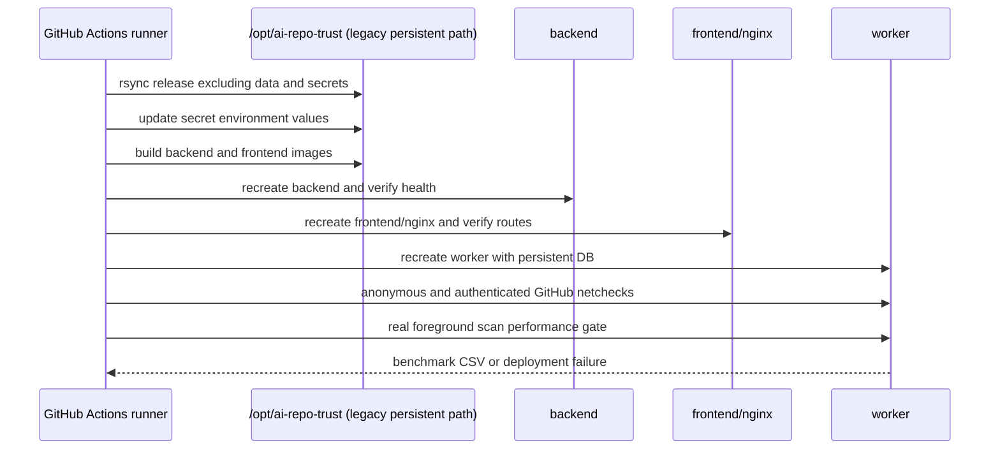

# Deployment and Operations

## Production topology

Production uses `.github/deploy/production/docker-compose.prod.yml` and five
long-running containers:

| Service | Role | Public port | Persistent data |
| --- | --- | --- | --- |
| `nginx` | TLS edge, routing, SSE proxy | HTTP/HTTPS host ports | certificate mount/cache only |
| `frontend` | Static React SPA | none | none |
| `backend` | REST, SSE, MCP, artifacts | none | `/data/trust.db` |
| `worker` | Foreground queue, evidence DAG, Slack alerts | none | `/data/trust.db` |
| `nvd-worker` | Dedicated NVD evidence worker | none | `/data/trust.db` |

The backend, worker, and NVD worker share the legacy persistent host path
`/opt/ai-repo-trust/data:/data`. The path is intentionally retained during the
product rename so existing production reports are not replaced. `sync_release`
excludes `data`, `.env.prod`, caches, and build targets. `prepare_data_dir`
preserves an existing database before containers are recreated.

The shared edge proxy is migrated independently, so the production backend and
frontend also retain the legacy `ai-repo-trust-*` Docker network aliases. These
compatibility aliases contain no product data and can be removed after the edge
proxy configuration uses the new `ai-supply-chain-trust-*` aliases.

## Routing

- `/` and browser routes -> frontend
- `/api`, `/api/*`, `/health`, `/sitemap.xml` -> backend
- `/mcp` -> backend
- `/r/*.json`, `/r/*.md` -> backend
- `/r/{owner}/{repo}` -> SPA shell
- legacy `/free-tools/*` URLs -> permanent redirect to the equivalent root URL
- `/api/v1/events` -> backend with proxy buffering disabled

## Sitemap policy

`/sitemap.xml` lists the six public core pages first. Repository context pages
follow in most-recently-evaluated order and are capped at 500 entries, well
below the protocol ceiling of 50,000 URLs or 50 MB uncompressed per sitemap.
Repository entries use the report evaluation date as `lastmod`; core pages omit
`lastmod` because no independently verifiable publication date is stored.

Only canonical root URLs are emitted. Legacy `/free-tools/*` paths remain as
permanent redirects for inbound-link migration and never appear in the sitemap.

Only Nginx publishes host ports. Backend and worker are reachable only on private
Docker networks.

## Deployment sequence


```mermaid
sequenceDiagram
    participant GH as GitHub Actions runner
    participant Host as /opt/ai-repo-trust (legacy persistent path)
    participant API as backend
    participant Web as frontend/nginx
    participant Worker as worker

    GH->>Host: rsync release excluding data and secrets
    GH->>Host: update secret environment values
    GH->>Host: build backend and frontend images
    GH->>API: recreate backend and verify health
    GH->>Web: recreate frontend/nginx and verify routes
    GH->>Worker: recreate worker with persistent DB
    GH->>Worker: anonymous and authenticated GitHub netchecks
    GH->>Worker: real foreground scan performance gate
    Worker-->>GH: benchmark CSV or deployment failure
```

## Required release gates

The deployment workflow is successful only when all of these pass:

1. Backend and frontend images build.
2. Backend `/health` and `/api/v1/healthz` respond from inside the container.
3. Frontend health and expected CSS reference respond.
4. Edge route responds after Nginx recreation.
5. Worker can reach GitHub anonymously and with configured credentials using the
   same Rust/Reqwest stack as the application.
6. A real queued repository scan satisfies acceptance, queue wait, foreground,
   total latency, and terminal-success gates.
7. The deployed public home passes Chromium mobile navigation plus axe with no
   serious or critical violations.

The benchmark result is stored at
`/opt/ai-repo-trust/data/deploy-scan-performance.csv`.

## Production execution plan

Production release is complete only after every phase has its recorded
evidence. The release manager owns go/no-go and rollback. The platform operator
owns host and secret access. The application owner validates user-visible
behavior and alert delivery.

| Phase | Owner | Action | Acceptance evidence | Stop condition |
| --- | --- | --- | --- | --- |
| 0. Preflight | release manager | Review dirty-worktree hash, `scripts/test_evidence.sh`, Compose config, and dependency exception record | Passing summary plus reviewed change scope | Missing evidence or unreviewed source change |
| 1. Protect state | platform operator | Confirm `/opt/ai-repo-trust/data` persists; make a WAL-safe SQLite backup before any schema-affecting release | Backup location, timestamp, restore owner | Backup cannot be verified |
| 2. Deploy | platform operator | Run production workflow from reviewed revision | Build, container readiness, GitHub authenticated netchecks, scan benchmark | Any workflow gate fails |
| 3. Public verification | application owner | Run `npm run test:public-release` against deployed origin, then manual keyboard/screen-reader smoke pass | Passing axe/mobile result and manual checklist | Serious/critical axe finding or failed task flow |
| 4. Resilience drill | platform operator | Perform queue-restart, dependency-outage, alert-delivery, and rollback drills one at a time | Queue resumes without duplicate terminal work; failure is visible; alert reaches owner; rollback preserves DB | Data loss, duplicate terminal work, unavailable rollback, or missing alert |
| 5. Closeout | release manager | Attach gate output, backup reference, drill output, public test result, and rollback decision to release record | All prior phases accepted | Any required artifact absent |

Never combine a dependency-outage drill with a rollback drill. First restore the
dependency, wait for queue recovery evidence, then begin the next controlled
exercise. Keep production credentials in the runner/secret store; do not place
them in the worktree or release record.

## Core configuration

| Variable | Production default | Meaning |
| --- | ---: | --- |
| `AI_SUPPLY_CHAIN_TRUST_DB_PATH` | `/data/trust.db` | Persistent SQLite file |
| `AI_SUPPLY_CHAIN_TRUST_DAEMON` | worker `1`, API `0` | Enable queue/evidence loops |
| `AI_SUPPLY_CHAIN_TRUST_DAEMON_MAX_CONCURRENT` | `6` | Independent foreground workers |
| `AI_SUPPLY_CHAIN_TRUST_DAEMON_QUEUE_INTERVAL` | `1` | Idle poll delay in seconds |
| `AI_SUPPLY_CHAIN_TRUST_WORKER_START_DELAY_SECONDS` | `0` | Delay before workers claim jobs |
| `AI_SUPPLY_CHAIN_TRUST_FOREGROUND_TIMEOUT_SECONDS` | `5` | Total metadata deadline for fast scans |
| `AI_SUPPLY_CHAIN_TRUST_GITHUB_TIMEOUT_SECONDS` | `20` | Per-request background client timeout |
| `AI_SUPPLY_CHAIN_TRUST_EVIDENCE_INTERVAL_SECONDS` | `1` | Idle evidence poll delay |
| `AI_SUPPLY_CHAIN_TRUST_EVIDENCE_HISTORY_CONCURRENCY` | `4` | Parallel checkpointed GitHub history workers |
| `AI_SUPPLY_CHAIN_TRUST_EVIDENCE_NVD_CONCURRENCY` | `2` | Parallel NVD evidence workers |
| `AI_SUPPLY_CHAIN_TRUST_EVIDENCE_FINALIZE_CONCURRENCY` | `2` | Parallel recovery/finalization workers |
| `AI_SUPPLY_CHAIN_TRUST_PROGRESSIVE_COMMIT_DETAIL_LIMIT` | `25` | Maximum detail tasks used for finalization |
| `GITHUB_TOKEN` / `GITHUB_TOKENS` | secret | Read-only GitHub credentials |
| `NVD_API_KEY` | secret | NVD request budget |
| `AI_SUPPLY_CHAIN_TRUST_ALERT_WEBHOOK_URL` | secret | Private failure diagnostics |
| `AI_SUPPLY_CHAIN_TRUST_FEEDBACK_WEBHOOK_URL` | secret | Slack incoming webhook for product feedback (falls back to alert webhook) |
| `AI_SUPPLY_CHAIN_TRUST_FAILURE_RECOVERY_INTERVAL_SECONDS` | config | Automatic recovery interval for transient failed work (default `600`) |
| `AI_SUPPLY_CHAIN_TRUST_WORKER_TOKEN` | secret | Admin/worker endpoint authorization |
| `AI_SUPPLY_CHAIN_TRUST_TRUSTED_PROXY_IPS` | empty | Comma-separated proxy IP allowlist; only these peers may supply client-IP headers |

`/healthz` is the readiness endpoint: it verifies the active SQLite/PostgreSQL connection. If daemon discovery is enabled, it also requires a configured GitHub token unless `AI_SUPPLY_CHAIN_TRUST_DAEMON_DISABLE_DISCOVERY=1` is set. `/health` remains a lightweight liveness endpoint.

The discovery worker itself refuses to start without a non-empty GitHub token; it never falls back to anonymous GitHub search in production.

`AI_SUPPLY_CHAIN_TRUST_DAEMON_DISCOVERY_TOPICS` optionally replaces the default GitHub topic set. It accepts at most 20 comma-separated topic slugs containing only lowercase letters, digits, and hyphens; invalid input falls back to the reviewed defaults.

Before enabling `DATABASE_URL` in production, run the opt-in PostgreSQL proof against an isolated database:

```bash
cd backend
TEST_DATABASE_URL=postgres://... \
  cargo test -p ai-supply-chain-trust-storage \
  postgres_health_and_report_mirror_are_verified -- --ignored
```

Worker progress crosses the container boundary through the persistent
`trust_events` table. The backend tails this table for SSE clients and honors
`Last-Event-ID`; the process-local broadcast channel is not a reliability
boundary.

Configured tokens are attempted first and rotate on authentication/rate-limit
failure; anonymous access is the final fallback. Multiple personal tokens from
the same GitHub account normally share the same primary quota. Rotation is for
credential failover, not rate-limit evasion.

## Local production-equivalent run

```bash
docker compose \
  --env-file .env.prod \
  -f .github/deploy/production/docker-compose.prod.yml \
  up --build
```

Run the deterministic suite before Docker:

```bash
scripts/test_evidence.sh
```

Run the same foreground performance gate:

```bash
BASE_URL=http://127.0.0.1:8000 scripts/benchmark_scan_pipeline.sh
```

## Restart and recovery

On database open, scan jobs left in `running` return to `queued`. Evidence tasks
with expired leases return to `queued` while completed checkpoints remain. The
queue deduplicates pending work by repository and lane.

After an unexpected restart verify:

```bash
curl -fsS https://ai-supply-chain-trust.aibim.ai/api/v1/queue/stats | jq
curl -fsS 'https://ai-supply-chain-trust.aibim.ai/api/v1/jobs?limit=20' | jq
```

Do not delete the data directory to clear a queue. Use authenticated operational
actions and preserve failure evidence.

## Rollback

Rollback code/images without replacing `/opt/ai-repo-trust/data`. Before a
schema-changing release, take an SQLite backup using its online backup mechanism
or a transactionally safe snapshot. A plain copy of an active WAL database is not
a valid backup unless the `-wal` state is included or checkpointed.

The deploy helper preserves this bind-mounted state. If it must recover a missing
host database from a running backend container, it copies `/data/trust.db`, never
`/tmp/trust.db`.
